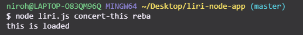
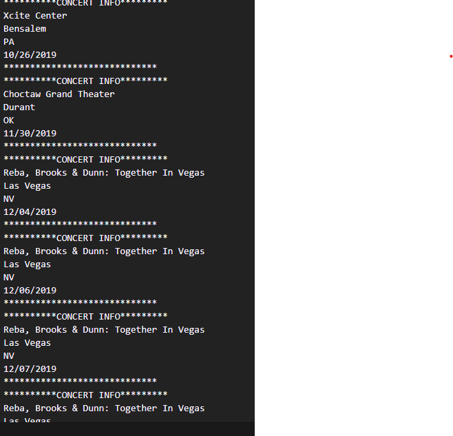
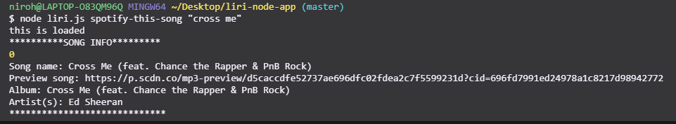
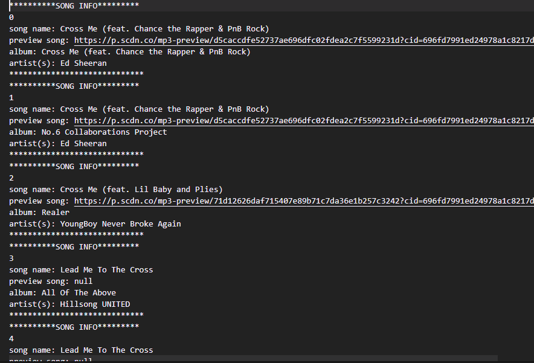
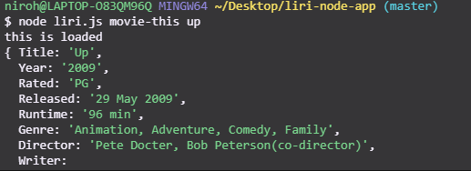
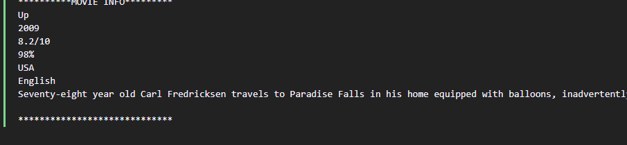
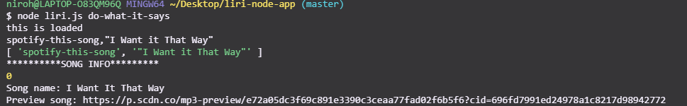
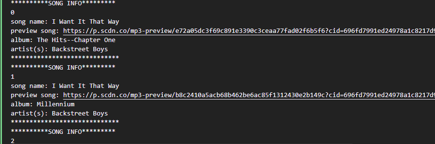
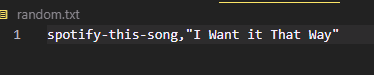

By: Nnamdi Iroham

Created: October 15 2019

<h1>Overview</h1>

LIRI is a Language Interpretation and Recognition Interface. LIRI will be a command line node app that takes in parameters and gives you back data. The user has the option of using four commands (listed below) in conjuntion with specific parameters associated with the commands. The Commands are:

- concert-this

- spotify-this-song

- movie-this

- do-what-it-says

# liri-node-app

Step by Step instructions

1.) Open your terminal such as Bash.

2.) Navigate to the folder that contains the liri.js file.

3.) Depending on the command you run, the output will vary.

Example 1: Run the concert-this command

 node liri.js concert-this name of artist or band

Example 2: Run the spotify-this-song command

node liri.js spotify-this-song name of song

Example 3: Run the movie-this command

 node liri.js movie-this name of movie
 
 
 
 
 Example 4: Run the do-what-it-says command

 node liri.js do-what-it-says
 
 
  
   
   
   TECHNOLOGIES USED
Javascript

Nodejs

Node packages:

Node-Spotify-API

Request

Moment

DotEnv

APIs used:

Bands in Town API

TRILOGY API

Git

GitHub
